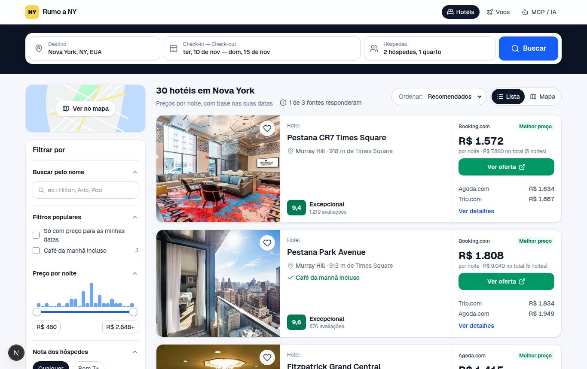
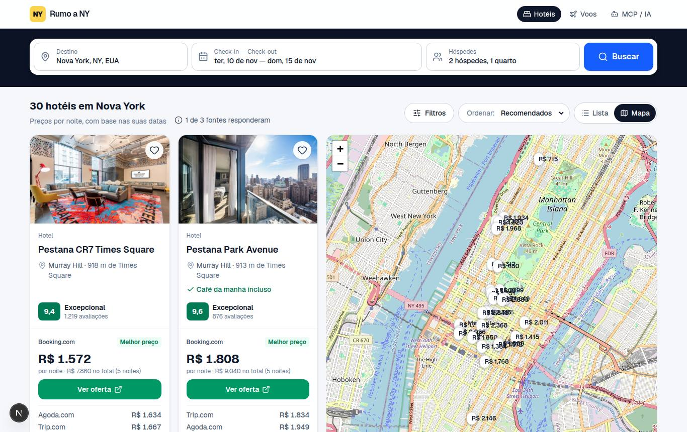
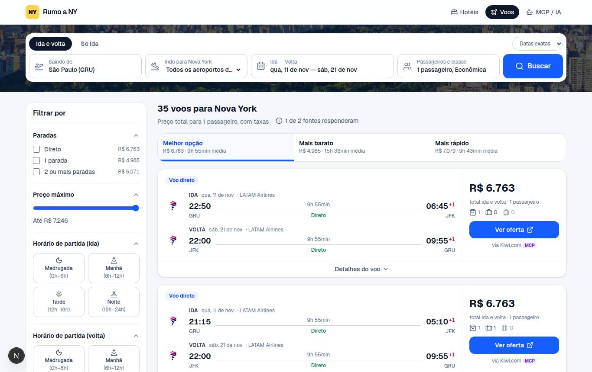
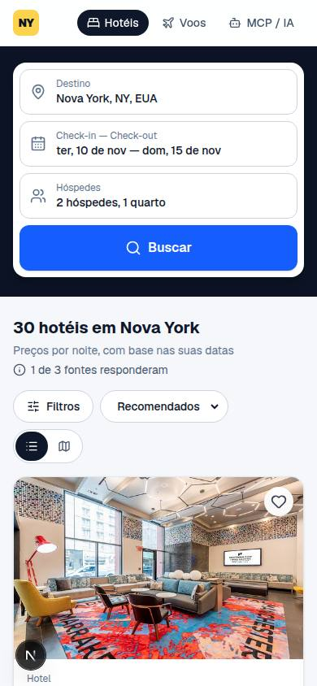
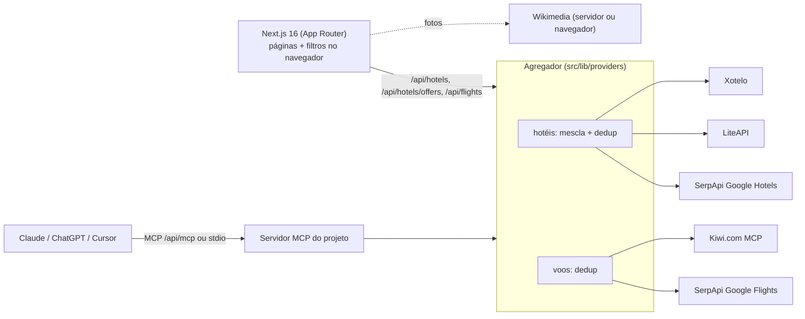

# Rumo a NY — hotéis e passagens para Nova York

Buscador de **hotéis e voos para Nova York** que agrega ofertas de APIs públicas e de servidores
**MCP (Model Context Protocol)**, com interface inspirada em Hotels.com, Trivago e Kayak.

- **Hotéis:** comparação de diárias entre sites (Booking.com, Expedia, Agoda, Trip.com, site do hotel…),
  filtros de preço (com histograma), nota, estrelas, bairro, distância a pontos turísticos, comodidades e sites;
  lista ou **mapa com pinos de preço**; página do hotel com galeria, comparador, **calendário de preços por noite** e mapa.
- **Voos:** busca via **servidor MCP oficial da Kiwi.com**, com abas *Melhor / Mais barato / Mais rápido* e
  filtros de paradas, horários, companhias, aeroporto de chegada (JFK/EWR/LGA), duração e bagagem.
- **Fotos:** do hotel (fontes de preço) + **Wikimedia Commons/Wikipédia** (prédio do hotel, arredores e bairros),
  sempre com autor e licença.
- **MCP nos dois sentidos:** o site *consome* o MCP da Kiwi.com e também *expõe* o próprio servidor MCP
  (`/api/mcp` e stdio) para Claude, ChatGPT, Cursor etc.

| Home | Resultados | Mapa |
| --- | --- | --- |
|  |  |  |

| Página do hotel | Voos | Mobile |
| --- | --- | --- |
|  |  |  |

## Começando

```bash
npm install
cp .env.example .env.local   # opcional: nada é obrigatório
npm run dev                  # http://localhost:3000
```

Sem nenhuma chave o site já busca dados reais (Kiwi.com MCP, Xotelo, Wikimedia, Frankfurter).
Chaves opcionais ativam mais fontes — veja [Fontes de dados](#fontes-de-dados).

| Script | O que faz |
| --- | --- |
| `npm run dev` | servidor de desenvolvimento |
| `npm run build` / `npm start` | build e servidor de produção |
| `npm test` | testes (Vitest) — filtros, provedores, Wikimedia, MCP |
| `npm run lint` / `npm run typecheck` | ESLint e TypeScript |
| `npm run mcp:stdio` | servidor MCP via stdio (Claude Desktop etc.) |

Requer Node.js 20.9+.

## Fontes de dados

| Fonte | Para quê | Chave | Como entra |
| --- | --- | --- | --- |
| [Kiwi.com MCP](https://www.kiwi.com/en/pages/mcp/) | voos | não | cliente MCP (Streamable HTTP) → ferramenta `search-flight` |
| [Xotelo](https://xotelo.com) | catálogo de hotéis do TripAdvisor + diárias por site, calendário de preços | não | REST |
| [LiteAPI](https://docs.liteapi.travel) | galeria de fotos, estrelas, comodidades, tarifas | `LITEAPI_KEY` (sandbox grátis) | REST |
| [SerpApi](https://serpapi.com) | Google Hotels e Google Flights | `SERPAPI_KEY` (cota grátis) | REST |
| [Wikimedia Commons / Wikipédia](https://www.mediawiki.org/wiki/API:Main_page) | fotos do prédio, dos arredores e dos bairros | não (token opcional) | Action API |
| [Frankfurter](https://frankfurter.dev) | câmbio (BCE) para converter estimativas | não | REST |
| [OpenStreetMap](https://www.openstreetmap.org/copyright) | mapa (Leaflet) | não | tiles |

> A Amadeus Self-Service API foi desligada em 17/07/2026, por isso não é usada.

Cada fonte é um *provider* isolado. Uma fonte com erro não derruba a busca: a UI mostra
"N de M fontes responderam" com o motivo de cada uma. Se **todas** falharem, o modo
`DEMO_MODE=fallback` mostra dados fictícios com um aviso bem visível.

## Arquitetura



- **Busca progressiva de hotéis:** a lista chega rápido (catálogo em cache) e os preços para as
  datas são comparados em lotes (`/api/hotels/offers`), preenchendo os cards aos poucos.
- **Mescla entre fontes:** o mesmo hotel vindo de fontes diferentes vira um card só
  (nome parecido + menos de 300 m), com todas as ofertas lado a lado.
- **Filtros e ordenação no navegador**, guardados na URL (links compartilháveis), sem recarregar.
- **Variedade nos voos:** o MCP da Kiwi devolve só ~15 itinerários (os mais baratos). O provedor faz
  três consultas — mais baratos, só diretos e excluindo as companhias já vistas — e une o resultado.
- **Cache em memória** com TTL e deduplicação de chamadas simultâneas; **limite por IP** nas rotas de API.

```
src/
  app/                 páginas (/, /hoteis, /hoteis/[fonte]/[id], /voos, /mcp) e rotas /api
  components/          busca (calendário duplo, hóspedes), cards, filtros, mapa, galeria, Wikimedia
  lib/
    providers/hotels   xotelo, liteapi, serpapi, demo, merge (agregador em index.ts)
    providers/flights  kiwi-mcp, serpapi, demo
    mcp/               client.ts (consome MCPs) e server.ts (servidor do projeto)
    filters/           filtros/ordenação/facetas puros + serialização na URL
    wikimedia*.ts      API do Wikimedia (isomórfica) + acesso do servidor com backoff
scripts/mcp-stdio.mts  servidor MCP via stdio
tests/                 Vitest + fixtures reais das APIs
```

## Servidor MCP

Ferramentas: `search_hotels`, `get_hotel_details`, `search_flights` e o prompt `planejar_viagem_nyc`.

```bash
# HTTP (com o site rodando)
claude mcp add --transport http rumo-a-ny http://localhost:3000/api/mcp
```

```jsonc
// Claude Desktop (stdio)
{
  "mcpServers": {
    "rumo-a-ny": {
      "command": "npm",
      "args": ["run", "--silent", "mcp:stdio", "--prefix", "/caminho/para/nyc-travel-search"]
    }
  }
}
```

O arquivo [`.mcp.json`](.mcp.json) já configura o Claude Code neste repositório com o servidor local e o da Kiwi.com.
Mais detalhes na página `/mcp` do site.

## Wikimedia: limites de uso

A API do Wikimedia limita requisições sem identificação a ~10/min por IP, e IPs de nuvem compartilhados
(CI, sandboxes, alguns provedores) costumam receber `HTTP 429`. O projeto lida com isso assim:

1. **User-Agent identificável** (`NycTravelSearch/0.1 (contato)`) — ajuste `WIKIMEDIA_CONTACT`.
2. **Token OAuth opcional** (`WIKIMEDIA_ACCESS_TOKEN`, de um *owner-only consumer* OAuth 2.0 criado no
   [meta.wikimedia.org](https://meta.wikimedia.org/wiki/Special:OAuthConsumerRegistration/propose/oauth2)) para limites
   de usuário autenticado; o cookie de sessão que o gateway devolve é reenviado, como a política exige.
3. **Respeita o `Retry-After`**: durante um bloqueio o servidor para de chamar a API (disjuntor).
4. **Fallback no navegador:** se o servidor não conseguiu, a página busca direto do navegador do
   visitante (CORS `origin=*` + `Api-User-Agent`), usando a cota de cada usuário.
5. As URLs do Wikimedia agora vêm com `?utm_source=…`; a extensão do arquivo é checada só no caminho.

## Deploy (Vercel)

O projeto roda na Vercel sem configuração extra (Next.js é detectado sozinho):

1. Em [vercel.com/new](https://vercel.com/new), importe o repositório `nyc-travel-search` do GitHub.
2. (Opcional) Em **Settings → Environment Variables**, adicione as chaves abaixo e faça *Redeploy*.
3. Cada push no `main` publica em produção; pull requests ganham um link de preview.

`NEXT_PUBLIC_SITE_URL` pode ficar vazia: o site usa o domínio de produção da Vercel
(`VERCEL_PROJECT_PRODUCTION_URL`). O cache e o limite por IP são em memória (por instância) —
para escala, troque por Redis/Upstash em `src/lib/cache.ts` e `src/lib/rate-limit.ts`.

### Como conseguir as chaves (todas opcionais)

| Variável | Onde pegar | Custo |
| --- | --- | --- |
| `LITEAPI_KEY` | Crie a conta em [liteapi.travel](https://liteapi.travel) (*Sign up*), abra o dashboard → **Developer → API Keys** e copie a chave **sandbox** | grátis (sandbox, sem cartão) |
| `SERPAPI_KEY` | Cadastre-se em [serpapi.com](https://serpapi.com/users/sign_up), confirme e-mail/telefone e copie a chave em [Api Key](https://serpapi.com/manage-api-key) | plano grátis com cota mensal (≈250 buscas) |
| `WIKIMEDIA_ACCESS_TOKEN` | Com uma conta Wikimedia, registre um consumer em [OAuth 2.0 → propose](https://meta.wikimedia.org/wiki/Special:OAuthConsumerRegistration/propose/oauth2), marque *"This consumer is for use only by …"* (owner-only), grants básicos, e copie o **access token** exibido | grátis |
| `NEXT_PUBLIC_MAP_TILES` | Só para tráfego alto: crie uma chave em [MapTiler](https://cloud.maptiler.com/account/keys/) e use a URL de tiles dela | grátis até um limite |

> A SerpApi cobra por busca: cada página de hotéis ou busca de voos consome 1 crédito
> (o cache de 15–30 min evita repetir buscas iguais).

## Avisos

- Preços e disponibilidade são das fontes e podem mudar até a reserva; o site não vende nada,
  só leva o usuário ao site parceiro.
- Respeite os termos de uso de cada API/fonte e as licenças das fotos do Wikimedia (o crédito é exibido).
